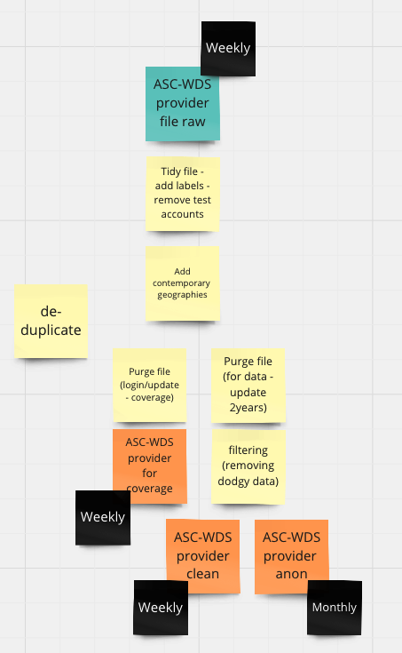

# Example - Clean Ascwds Workplace data



## Functions present

```{eval-rst}
.. automodule:: projects._01_ingest.ascwds.jobs.clean_ascwds_workplace_data
   :members:
```

## How functions interact within the script

Could put a diagram here of the pipeline at this level?

Maybe reference individual functions?

```{eval-rst}
.. automodule:: utils.utils
   :members:
```
