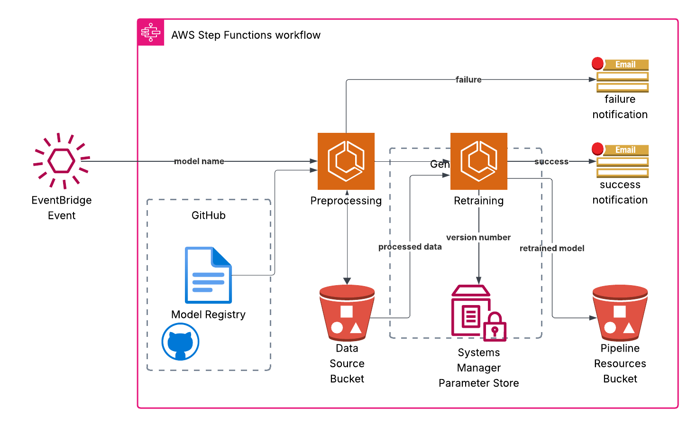

# Model Retraining

## Process overview
This work is intended to build on the datasets produced by the jobs in the [feature engineering](/Users/joemulvey/Projects/SkillsForCare/DataEngineering/projects/_03_independent_cqc/_04_feature_engineering)
section. For a broad range of regression models, the process will ensure that training data is prepared and clean, 
generate training and test samples from the data, train the parameters for given features/targets, test that they
are valid, serialise the model and write it to an S3 location with an incremented version number. A notification is 
sent via SNS to subscribed users on the completion of retraining.

The process is illustrated below.



All models should be defined in a "model registry" (a version-controlled file included in this repository). After
being provided with the model identifier, the process is designed to be as generic as possible. All relevant
configuration can be found in the registry.

## Deploying a new model
To deploy a new model, mirror the steps for the example process provided `non_res_pir`.
1. If the source data for the model requires some custom preprocessing (e.g. removing nulls), then write an
    appropriately-named function to carry out the processing and add it to the `preprocessing.py` field in 
    the `preprocessing` directory.
2. Add the model details to the registry following the example already provided. There are three model types,
    currently: SIMPLE_LINEAR, LASSO and RIDGE. Note that the location for the version parameter must begin with
    slash `/` character. Enter any special parameters (e.g. a regularisation parameter in the `model_params` section).
3. Create or edit a Step Function to first call the preprocessing step and then the retraining step. You can refer to 
    the example [here](/Users/joemulvey/Projects/SkillsForCare/DataEngineering/terraform/pipeline/step-functions/DemoModelRetrain-StepFunction.json)

## Semantic versioning
The [version_manager](/Users/joemulvey/Projects/SkillsForCare/DataEngineering/projects/_03_independent_cqc/_05_model/utils/version_manager.py)
manages how the models are versioned. The numbering is in the format `a.b.c` where a,b and c are integers. The version 
is stored in Parameter Store. The automated retraining process only changes c, indicating a routine retraining on new data.

Changes of an intermediate nature (e.g. a parameter change or a change in features) could be effected by a manual edit in
Parameter Store. Likewise, a major change (such as a new Model Type) would be made manually.

## Model Serialisation
All the models are serialised using the Python built-in `pickle` format, which is be used to store arbitrary binary data,
in this case the model class instances. The `pickle` format adequate as long as the models remain simple. Other libraries
can be used if needs become more complex.


## How to refresh the docker image on AWS 
If you have made a change to the model training scripts, or added a model to `model_registry.py` you may need to 
redeploy the Docker image. This is included in the Circle CI process, but you may want to carry out the process manually.
To do this, you need to ensure that you have [Docker](https://docs.docker.com/engine/install/) installed on your local
machine, including the `docker` command line utility. You will also need the [AWS CLI](https://docs.aws.amazon.com/cli/latest/userguide/getting-started-install.html)
and be able to authenticate to the AWS account.

Begin by authenticating to the AWS account.

Create an environment variable with the AWS Account ID (replacing the sample with your account id):
```commandline
export AWS_ACCOUNT_ID=12345678912
```
(You can see the account number in the top-right corner of the AWS console, after you log in, or you can use the
command `aws sts get-caller-identity` to retrieve it.)

Authenticate with ECR using:
```commandline
aws ecr get-login-password --region eu-west-2 | docker login --username AWS --password-stdin ${AWS_ACCOUNT_ID}.dkr.ecr.eu-west-2.amazonaws.com
```

Build your image with:
```commandline
 docker buildx build --platform linux/amd64 -f projects/_03_independent_cqc/_05_model/fargate/Dockerfile -t fargate/model-retrain . --load
```
(This command ensures that the Docker image created is compatible with the Linux operating system used in AWS Fargate.)

Tag your image so Fargate knows where to put it:
```commandline
docker tag fargate/model-retrain:latest ${AWS_ACCOUNT_ID}.dkr.ecr.eu-west-2.amazonaws.com/fargate/model-retrain:latest
```

Push the image to your repository:
```commandline
docker push ${AWS_ACCOUNT_ID}.dkr.ecr.eu-west-2.amazonaws.com/fargate/model-retrain:latest
```
